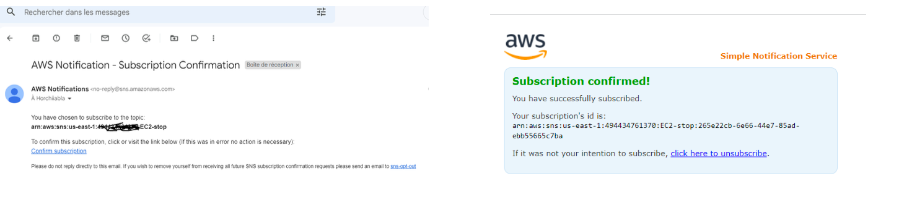
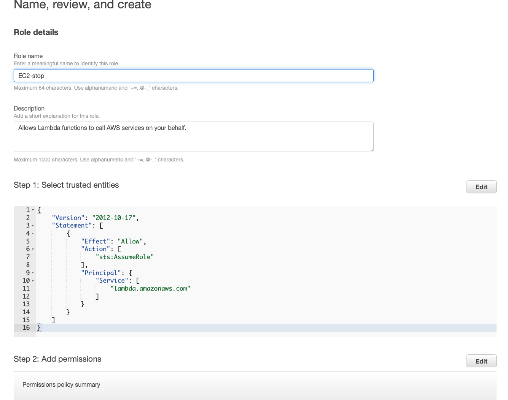
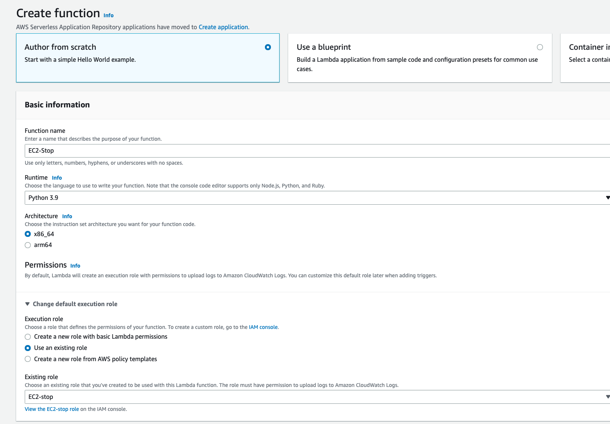

# Audit and Control Hands On

In this lab you will build a scenario where an EC2 instance failure will generate a CloudWatch Log. You will then trigger 
a Lambda function in response to the failure that will send an email to the account owner using an SNS Service.


## Deliverables 
1. An image of SNS sending you an email that your server was stopped. (Check the last image of the hands on)

## Prerequisites

1. **MAKE SURE YOU DO ALL YOUR WORK ON `us-east-1`**

## Instructions

### Create an EC2 instance

1. Open the EC2 console and create an EC2 instance named `ec2-stop`
    1. The EC2 instance needs to have an SSH key
    1. The EC2 instance needs to be in a public subnet
    1. After creating the EC2 instance copy the `instance-id` you will need it later


### Create and Configure an SNS Topic 

1. Open Amazon SNS console, on the left nagivation pane select "Topics" and then click on "Create Topic."

    

        
1. When creating the SNS topic:
    1. Select `Standard`
    1. Enter the name of the topic as `EC2-stop`
    1. Open `Access Policy` 
        1. Select `Everyone` for `Define who can publish messages to the topic`
    1. Click on Create Topic


        

1. After creating the Topic, go the topic you have already created, and click on `Create Subscription`

    

1. Configure the subscription:
    1. Copy the `ARN` for the topic, **you will need it later**
    1. Set the Protocol to `Email`
    1. For Endpoint enter your email.
    1. Click on `Create Subscription`
    
    
    

1. Check your email and you will find a confirmation email. Confirm your subscription **Make sure to check your spam/junk**

    


### Create an IAM Policy and Attach it to a Role

1. Open IAM console, in navigator pane select policies and click on create policy.

    

1. Configure your IAM Policy:
    1. For service, choose `SNS`
    1. For Actions, select all
    1. For resources, select `All resources`
    1. Click on `Add additional Permissions`
        1. For service choose `CloudWatch Logs` **It has to be CloudWatch Logs not just CloudWatch**
        1. For Actions, select all
        1. For resources, select `All resources`
    
    

    1. Click on Next
    1. Click on Next again
    1. Enter a policy name `EC2-stop`, click on `Create Policy`

1. Create a Role.
    1. After creating an IAM policy, go the navigator pane, select Roles and click on `Create Role`

        

    1. At the bottom of the options, under `Use cases for other AWS Services` select `Lambda`. Then select the circle next to `Lambda` and click Next

        

    1. Search the policy `EC2-stop` that you created and click on Next

        

    1. Enter a name for the role `EC2-stop`, scroll down and click `Create Role`

        

### Create a Lambda Function
1. Open AWS Lambda Console and click `Create Function`

    

1. Enter function name as `EC2-stop`
1. For Runtime select `Python 3.9`
1. For Execution Role select `Use an existing role`
    1. Choose the IAM role that you created.
1. Click on Create Function

    

1. Paste the following code into the function **Make sure to delete all other code before pasting this code and make sure to replace the value of topic_arn with the ARN you copied earlier. The code will only work if you name your topic `EC2-Stop` otherwise you will have to replace that with the name of your SNS topic**

    ```
    import boto3

    client = boto3.client('sns')
    def lambda_handler(event, context):

        topic_arn = 'arn:aws:sns:us-east-1:227159494082:ec2-stop' 
        message = 'your server is down' 
        client.publish(TopicArn=topic_arn, Message=message)
    ```
1. Click on Deploy

### Create a rule for receiving events in CloudWatch Logs when a specific EC2 instance fails

1. Open Amazon EventBridge console. On the navigation pane click on Rules and `Create Rule`
    1. Give the rule a name and click Next
    1. For event source, select `AWS events or EventBridge partner events.`
    1. Scroll down to `Creation Method`
        1. For Event Source, choose `AWS services`
        1. For AWS service, choose `EC2`
        1. For Event Type, choose `EC2 Instance State-change Notification`
            1. Select `Specific state(s)` and choose `stopped`
            1. Select `Specific instance Id(s)` and paste the instance-id from the EC2 instance that you created

            
        1. Click Next
    1. Select a Target
        1. Under `Select a target` choose `Lambda function`
        1. Select the Lambda function you just created and click `Next`
        
    1. Click Next again
    1. Click `Create rule`

### Test
1. Open EC2 Console
1. Select EC2 instance that you created in the beginning of this lab, click on the instance status and stop the instance
1. Wait until the instance has stoppped (This may take a couple of seconds even if it tells you that it already stopped it may still take 1-2 minutes)
1. Check your email, you should get an email saying your instance was stopped

